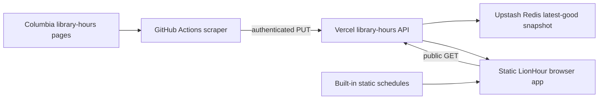

# Hybrid Library Hours Design

## Goal

Keep LionHour's static HTML experience while updating the Libraries section from Columbia University Libraries' published hours approximately every four hours without requiring Vercel Pro.

## Scope

- Preserve `index.html` and static assets as the primary website.
- Scrape only the six libraries currently displayed by LionHour from `https://hours.library.columbia.edu/locations/<slug>`.
- Run the scraper from GitHub Actions every four hours and on manual dispatch.
- Publish validated snapshots through a protected Vercel Function.
- Store the latest successful snapshot in Upstash Redis.
- Read that snapshot through a public, cacheable API endpoint.
- Fall back to the schedules embedded in `index.html` whenever dynamic data is missing, invalid, or unreachable.

Adding new library cards, changing the site's visual design, and making non-library venue hours dynamic are outside this change.

## Architecture

The browser continues to receive static `index.html`. It renders immediately with the existing built-in hours, requests `GET /api/library-hours`, validates the response, overlays the six library schedules, and renders again. Failure of the API request never blocks the rest of the page.

GitHub Actions runs the Python scraper at minute 17 every fourth UTC hour. The action produces a versioned JSON document and uploads it with an authenticated `PUT /api/library-hours` request. The API validates the entire document before atomically replacing the single Redis value at `lionhour:library-hours:v1`.

## Identity and Parsing Contract

Application identity is explicit and independent of Columbia URL slugs. Each source definition has a stable scraper ID, a source slug, and a frontend venue ID:

| Scraper ID | Columbia slug | Frontend venue ID |
|---|---|---|
| `butler_24` | `butler-24` | `butler` |
| `science_engineering` | `science-engineering` | `noco` |
| `lehman` | `lehman` | `lehman` |
| `business` | `business` | `uris` |
| `avery` | `avery` | `avery` |
| `math` | `math` | `math` |

Calendar parsing has three outcomes: a valid open interval, an explicitly closed day, or a parse error. A parse error is never represented as closed and makes the snapshot unpublishable. Midnight closing is normalized to `00:00`. Butler is the only displayed library approved for an overnight interval. The known Lehman source inversion is represented by an explicit per-library embedded-fallback marker, never coerced into guessed hours; raw unapproved overnight intervals remain invalid.



## Data Contract

The stored and returned document keeps the current scraper's library structure and adds an explicit schema version:

```json
{
  "schemaVersion": 1,
  "generated": "2026-08-20T12:00:00-04:00",
  "generatedDisplay": "August 20, 2026 at 12:00 PM",
  "libraries": [
    {
      "id": "butler_24",
      "name": "Butler Library",
      "url": "https://hours.library.columbia.edu/locations/butler-24",
      "note": null,
      "temporarilyClosed": false,
      "schedules": [
        {
          "label": "Current",
          "start": "2026-08-16",
          "end": "2026-08-22",
          "hours": {
            "0": null,
            "1": { "open": "09:00", "close": "21:00" },
            "2": { "open": "09:00", "close": "21:00" },
            "3": { "open": "09:00", "close": "21:00" },
            "4": { "open": "09:00", "close": "21:00" },
            "5": { "open": "09:00", "close": "19:00" },
            "6": { "open": "11:00", "close": "18:00" }
          }
        }
      ]
    }
  ]
}
```

Validation requires schema version `1`, an ISO timestamp, exactly the six displayed scraper IDs, canonical `HH:MM` times, and source URLs under `hours.library.columbia.edu`. A normal entry requires a schedule covering the generated Eastern date. Only Lehman may instead use `useEmbeddedFallback: true`, `fallbackReason: "unapproved-overnight-hours"`, and an empty schedule array.

Published snapshots contain exactly the six displayed libraries. `temporarilyClosed` must be Boolean; when true, the active schedule must contain only closed days. An embedded-fallback entry cannot also be temporarily closed or carry dynamic schedules.

## Reliability and Safety

- A scrape is publishable when every normal entry parses successfully and covers the generated date; the single approved Lehman anomaly may explicitly retain its embedded schedule while the other five update.
- Closed is valid source data; missing or unparseable hours are failures and cannot overwrite the current snapshot.
- Only Butler may publish overnight-style intervals. Lehman's live August 20, 2026 `9:00PM-5:00PM` entry becomes a narrow embedded-fallback marker rather than a misleading twenty-hour window or a guessed correction.
- The API validates before writing. Validation, authentication, Redis, or network failure preserves the previous value.
- Public reads are cached for five minutes. A stale response may be served while background revalidation runs for up to one hour; healthy revalidation refreshes subsequent responses.
- The frontend validates again before applying data and retains built-in schedules on every failure path.
- The Libraries section shows the snapshot's generated time. Data older than eight hours, or embedded fallback data used after an API failure, is visibly marked stale and links to Columbia's source hours. A fresh partial snapshot reports that five of six libraries are live and that Lehman is using its embedded fallback.
- The update secret is stored separately in GitHub Actions and Vercel environment secrets and is never sent to browsers.
- The update route uses a timing-safe bearer-token comparison and accepts only `PUT`; public access is read-only through `GET`.

## Scheduling

GitHub Actions uses `17 */4 * * *`, avoiding the start-of-hour congestion GitHub documents for scheduled workflows. It also supports `workflow_dispatch` for manual refreshes. The workflow receives read-only repository permissions, does not commit generated data, reads the target endpoint from `vars.LIBRARY_HOURS_API_URL`, and publishes only when `vars.LIBRARY_HOURS_PUBLISH_ENABLED` is `true`.

## Cost and Operations

The initial storage target is one Upstash Redis free database. The workload is six writes per day plus cache-miss reads from the Vercel Function; the plan must verify this remains within the provider's current free quota before rollout. The scheduled writes keep the database active while the workflow is healthy. GitHub Actions failure notifications, the eight-hour stale indicator, and a documented manual dispatch are the baseline monitoring policy; external paging is out of scope for this personal project.

## Testing

- Python unit tests cover time parsing, explicit closed days, parse errors, stable identity mapping, calendar extraction, schedule selection, complete-snapshot validation, suspicious overnight rejection, and failed-library behavior using both minimal and fuller captured Columbia HTML fixtures.
- Node tests cover the shared JSON validator, authenticated writes, rejected writes, public reads, missing snapshots, and cache headers with an in-memory store.
- Browser-oriented Node tests cover successful overlay, explicit Lehman-only fallback, invalid response fallback, network failure fallback, and status calculations after hydration.
- A manual staging run seeds Redis, reads the public API, loads the page, and verifies Butler against the Columbia source page before production rollout.

## Rollout and Rollback

Deploy the API and fallback-capable frontend before enabling the scheduled workflow. Provision Redis and matching update secrets, manually run the workflow once, verify the stored timestamp and browser rendering, and then leave the schedule enabled.

Rollback requires disabling the workflow and reverting the frontend loader; the embedded schedules continue to render. The Redis snapshot can remain in place because it is unreachable after the API/frontend revert and contains only public library hours.
